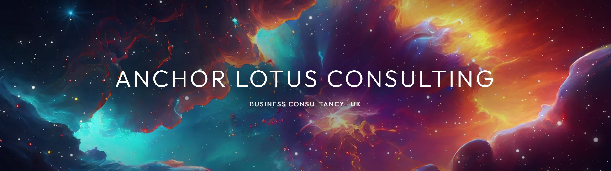
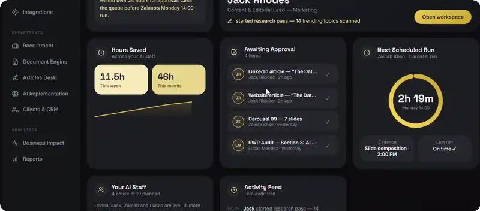
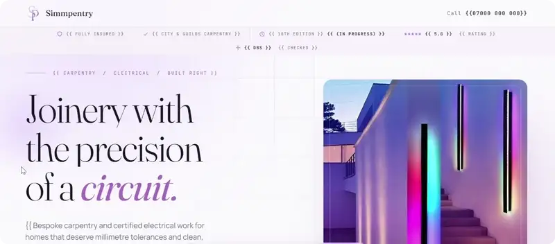
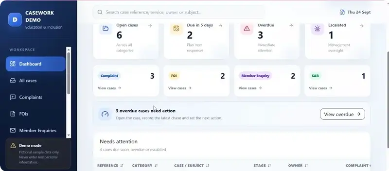
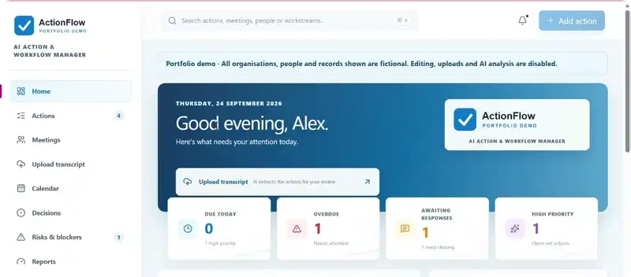
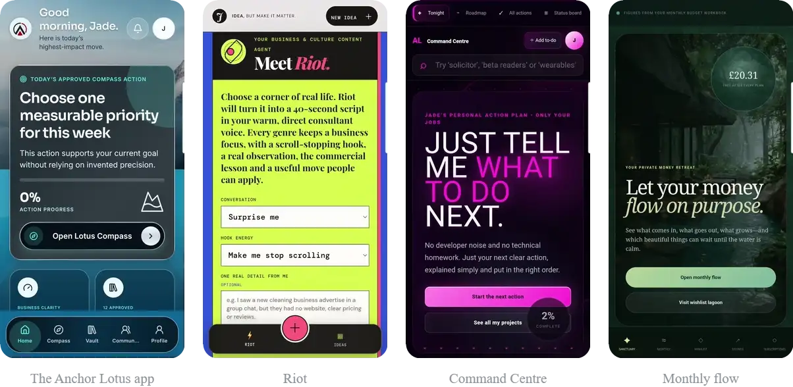
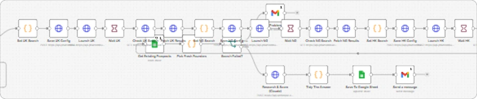

<h3 align="center">Your business. Intelligently designed.</h3>

Business transformation consultancy, practical systems and a clearer path to growth. 
We design and build the websites, apps, AI tools and automations a business runs on.

<a href="https://anchorlotusconsulting.com"><b>Website</b></a> &nbsp;·&nbsp;
<a href="https://anchorlotusconsulting.com/services"><b>Services &amp; pricing</b></a> &nbsp;·&nbsp;
<a href="https://anchorlotusconsulting.com/client-stories"><b>Client stories</b></a> &nbsp;·&nbsp;
<a href="https://anchorlotusconsulting.com/contact"><b>Let’s talk</b></a> &nbsp;·&nbsp;
<a href="https://www.linkedin.com/in/jadebelliott"><b>LinkedIn</b></a>

 

## Selected work

Client code stays private. Here is the work on its own screens.

<table>
<tr>
<td width="50%" valign="top">

<b>The control centre</b> AI operations · designed, built and run

An AI workforce that behaves like a team. Work is drafted overnight and queued for approval. Nothing leaves until a person says yes.

</td>
<td width="50%" valign="top">

<b>Simmpentry</b> Website · strategy, design and build

A trade site that answers the doubt before anyone picks up the phone. One clear next step: book a survey.

</td>
</tr>
<tr>
<td width="50%" valign="top">

<b>Education &amp; Inclusion casework</b> Casework system · complaints, FOIs, Member Enquiries, SARs

Four statutory workflows on one system instead of four. Cases route to the right owner, deadlines are tracked, and every case keeps a full timeline.

</td>
<td width="50%" valign="top">

<b>ActionFlow</b> Action &amp; workflow system · built around meeting transcripts

A meeting transcript goes in. Actions come out with an owner, a priority and a RAG status. The AI extracts; a person decides.

</td>
</tr>
</table>

### Apps, built end to end

- **The Anchor Lotus app** · Native mobile app Opens on one approved move for the week, then gets out of your way.
- **Riot** · AI content agent One real thing from your week goes in. A forty-second script in your voice comes out.
- **Command Centre** · AI build planner Answers the only question that matters: what do I do next?
- **Monthly flow** · Personal finance app Opens with what is genuinely free once every plan is paid.

### Automation

**The prospect engine** · n8n automation · lead generation 
Searches one market after another, drops anyone already on the list, then researches and scores the rest and drafts the approach. The only human step is the yes.

 

## Also from Anchor Lotus

- **[Intelligence OS](https://anchorlotusconsulting.com/intelligence)** — customers, work and money in one place. Take the guided tour.
- **[Children’s services](https://anchorlotusconsulting.com/childrens-services)** — inspection-ready data, fixed at source.
- **[Client stories](https://anchorlotusconsulting.com/client-stories)** — two case studies, with the results.

 

<a href="https://anchorlotusconsulting.com/contact"><b>Start a conversation →</b></a>

