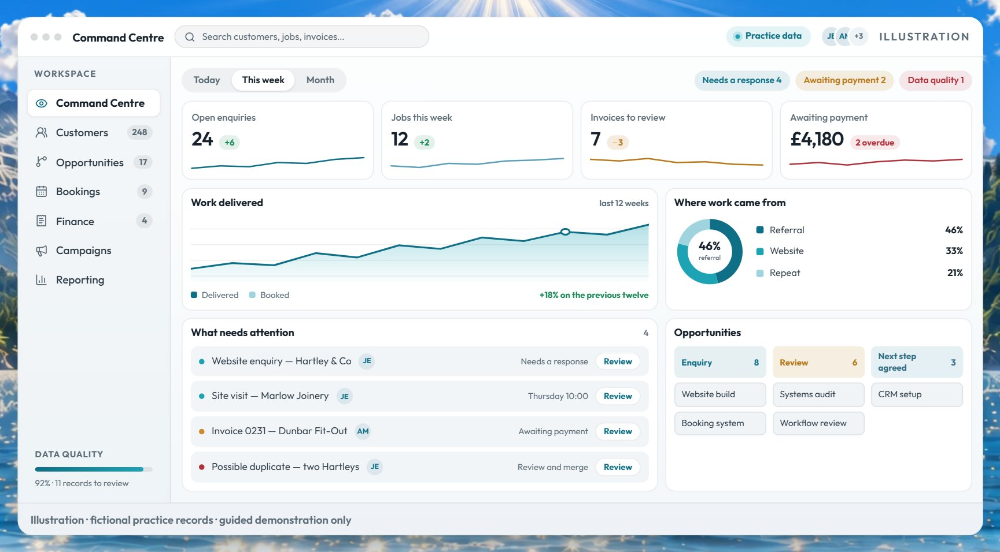

<h3 align="center">Clarity. Structure. Confident growth.</h3>

Business transformation consultancy, practical systems and a clearer path to growth. 
We design and build the websites, apps, AI tools and automations a business runs on.

<a href="https://anchorlotusconsulting.com"><b>Website</b></a> &nbsp;·&nbsp;
<a href="https://anchorlotusconsulting.com/services"><b>Services &amp; pricing</b></a> &nbsp;·&nbsp;
<a href="https://anchorlotusconsulting.com/client-stories"><b>Client stories</b></a> &nbsp;·&nbsp;
<a href="https://anchorlotusconsulting.com/contact"><b>Let’s talk</b></a> &nbsp;·&nbsp;
<a href="https://www.linkedin.com/in/jadebelliott"><b>LinkedIn</b></a>

 

## Results

<table>
<tr>
<td width="33%" valign="top" align="center">
<h3>£9M+</h3>
unaccounted costs identified, not recovered 
<b>Council work · Croydon &amp; Newham</b> 
Placement-finance audits, and five Newham workstreams, all on schedule
</td>
<td width="33%" valign="top" align="center">
<h3>£4,000 saved</h3>
and customer base up 10% 
<b>Wash N’ Shine · mobile valeting</b> 
Which vehicle to buy, what it would cost, and an Instagram plan
</td>
<td width="33%" valign="top" align="center">
<h3>£3,000+ saved</h3>
and 6 new clients 
<b>Compass Reformation · personal trainer</b> 
About to spend thousands on a new website; engagement wasn’t turning into clients
</td>
</tr>
</table>

> “I’d like to share my sincere appreciation for Anchor Lotus Consulting and the incredible support they’ve given me in exploring the possibilities of bringing my business into the digital space.”
>  — **Vyenna, Simmpentry**

Each result is from one engagement. Yours may differ. Full stories: <a href="https://anchorlotusconsulting.com/client-stories">anchorlotusconsulting.com/client-stories</a>

 

## Selected work

Client code stays private. Here is the work on its own screens.

<table>
<tr>
<td width="50%" valign="top">

<b>The control centre</b> AI operations · designed, built and run

An AI workforce that behaves like a team. Work is drafted overnight and queued for approval. Nothing leaves until a person says yes.

</td>
<td width="50%" valign="top">

<b>Simmpentry</b> Website · strategy, design and build

A trade site that answers the doubt before anyone picks up the phone. One clear next step: book a survey.

</td>
</tr>
<tr>
<td width="50%" valign="top">

<b>Education &amp; Inclusion casework</b> Casework system · complaints, FOIs, Member Enquiries, SARs

Four statutory workflows on one system instead of four. Cases route to the right owner, deadlines are tracked, and every case keeps a full timeline.

</td>
<td width="50%" valign="top">

<b>ActionFlow</b> Action &amp; workflow system · built around meeting transcripts

A meeting transcript goes in. Actions come out with an owner, a priority and a RAG status. The AI extracts; a person decides.

</td>
</tr>
</table>

### Apps, built end to end

- **The Anchor Lotus app** · Native mobile app Opens on one approved move for the week, then gets out of your way.
- **Riot** · AI content agent One real thing from your week goes in. A forty-second script in your voice comes out.
- **Command Centre** · AI build planner Answers the only question that matters: what do I do next?
- **Monthly flow** · Personal finance app Opens with what is genuinely free once every plan is paid.

### Automation

**The prospect engine** · n8n automation · lead generation 
Searches one market after another, drops anyone already on the list, then researches and scores the rest and drafts the approach. The only human step is the yes.

### Intelligence OS

**A clearer picture of your business.** Customers, work and money in one place, and every figure opens its source. 
In guided demonstration. The picture is an illustration with fictional practice records. &nbsp;<a href="https://anchorlotusconsulting.com/intelligence"><b>Book a guided demonstration →</b></a>

 

## How we work

1. **Understand the business.** Start with what feels harder than it should.
2. **Agree what comes next.** What changes, in what order, who owns it, what it costs.
3. **Put it into use.** Designed around how you work. Built, then tested end to end.
4. **Keep it working.** So the change holds after the project ends.
5. **Work on it together.** One to one. Start small; go further when ready.

## Services &amp; pricing

| Service | What you get | Price |
|:--|:--|--:|
| Consultation | One problem, 30 minutes, with a short written assessment | £50 |
| Single session | One priority, with a written summary | £100 |
| Session packages | No expiry | £400 for 5 · £700 for 10 |
| Business Clarity Audit | Review, process map, data check, action plan | £750–£1,500 |
| Process Improvement Sprint | A redesigned process and a checklist to run it | £1,500–£4,000 |
| Data &amp; Reporting Clean-Up | Cleaner data, a KPI outline, a reporting rhythm | £750–£2,500 |
| Growth Systems Retainer | Strategy, support and reporting, monthly | from £600 |
| Websites, business systems &amp; workflows | Designed around how you work, tested end to end | quoted |
| Children’s services specialist | Data quality, inspection preparation, statutory returns, Power BI | from £350/day outside IR35 · from £400/day inside |

Scope and price are agreed in writing before anything begins. Current prices: <a href="https://anchorlotusconsulting.com/services">anchorlotusconsulting.com/services</a>

 

## Built with

TypeScript · React · Next.js · React Native (Expo) · Supabase · Tailwind CSS · n8n · OpenAI API · Playwright · Netlify

**Founder’s learning credentials:** Microsoft Power BI Data Analyst · Google Data Analytics · Google Business Intelligence · IBM Generative AI Engineering · Oracle Cloud Infrastructure Foundations

 

<a href="https://anchorlotusconsulting.com/contact"><b>Your business next? Let’s talk →</b></a>

